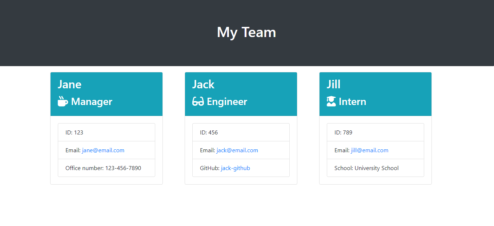

# team-profile-generator
> This is a command-line application that takes in information about employees on a software engineering team and generates an HTML webpage that displays summaries for each person.

## Table of contents
* [General info](#general-info)
* [Screenshots](#screenshots)
* [Link](#link)
* [Status](#status)
* [Credits](#credits)

## General info
This project was built with Node, JS, HTML, Bootstrap, and Font Awesome.

## Screenshots

## Link
- https://github.com/sharee-k/team-profile-generator
- https://drive.google.com/file/d/1d3hnBJYBfM-NV-Ximz8XQQSAH4iOqlkk/view

## Status
This project is finished for this training challenge.

## Credits
Sharee Burkeen (https://github.com/sharee-k)